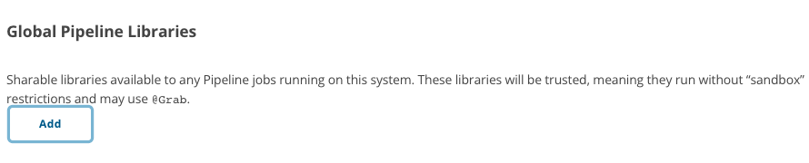

[  ](https://www.apache.org/licenses/LICENSE-2.0)


Horme
=====

Horme is a "[Shared Library](https://www.jenkins.io/doc/book/pipeline/shared-libraries/)" which can be imported as an 
external source control repositories and loaded into existing Jenkins Pipelines.

The version of Horme used in Jenkins will be "master"


Custom Steps
------------

Horme defines global variables which behave similarly to built-in steps, such as `sh` or `git`:

- [**docker compose up** with a specified project name](./vars/composeUp.groovy)
- [Remove Docker images by name or regex pattern](./vars/removeAllImages.groovy)
- [Force stop and remove Docker containers by name or regex pattern](./vars/removeAllContainers.groovy)


Install Horme on Jenkins
------------------------

There are several places where Horme can be loaded, depending on the use-case. The most common approache is through
**Manage Jenkins** » **Configure System** » **Global Pipeline Libraries**:



Since the library will be globally usable, any Pipeline in the system can utilize functionality implemented in Horme

### Using Horme

If Horme was marked _Load implicitly_, pipelines will be allowed to immediately use the Horme 
classes or global variables. For example, to
[force stopping and removing some Nginx container by name or regex pattern](./vars/removeAllContainers.groovy) and then
[remove its Nginx image](./vars/removeAllImages.groovy):

```
pipeline {
    ...
    
    stages {
        ...
    
        stage {
            ...
            
            steps {
                ...
            
                removeAllContainers("my-nginx-container")
                removeAllImages("nginx:latest")
                
                ...
            }
            
            ...
        }
        
        ...
    }
    
    ...
}
```


License
-------

The use and distribution terms for [Horme](https://github.com/QubitPi/horme) are covered by the
[Apache License, Version 2.0](http://www.apache.org/licenses/LICENSE-2.0.html).

<div align="center">
    <a href="https://opensource.org/licenses">
        
    </a>
</div>
